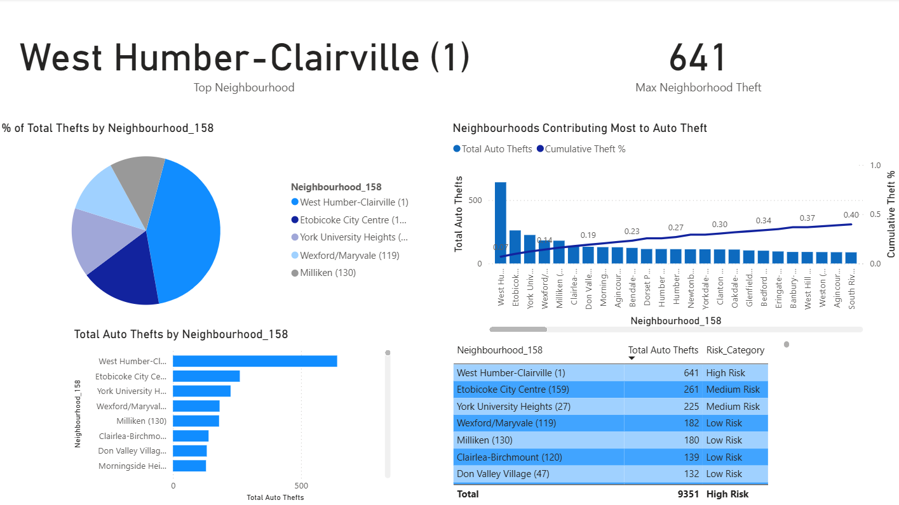
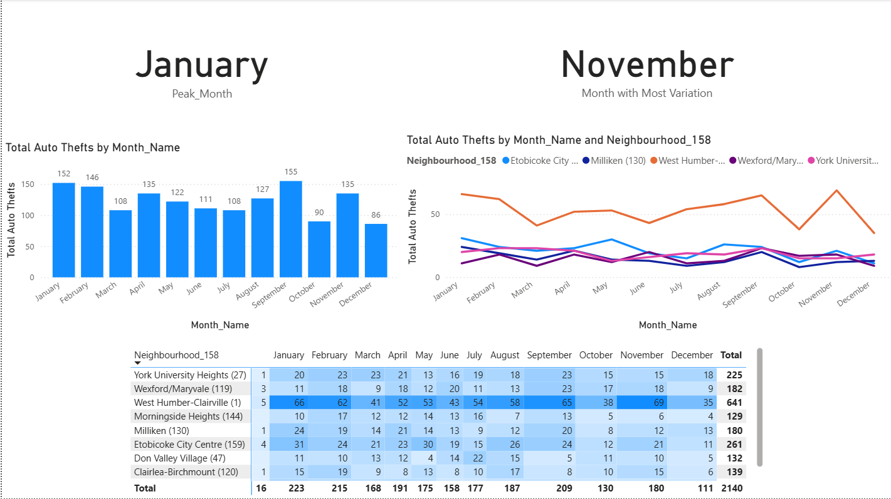

# 🚨 Toronto Auto Theft Analysis Dashboard

This capstone project explores the growing issue of auto theft in Toronto using real-world data from the Toronto Police. We built an interactive Power BI dashboard to uncover when and where thefts are most likely to happen — helping make smarter decisions around public safety and prevention strategies.

---

## 🎯 What We Set Out to Do

Our goal was to understand auto theft patterns across Toronto through visual analysis and data storytelling. We wanted to answer questions like:
- Which neighborhoods see the most thefts?
- What time of day or day of the week are vehicles most at risk?
- Are certain types of locations more vulnerable?

---

## 🔍 Why This Project Matters

Auto thefts in Toronto have been on the rise, but traditional reporting doesn’t make it easy to spot patterns or act quickly. Our challenge was to create a clear, interactive dashboard that could help law enforcement, city officials, and even residents:
- Pinpoint theft hotspots
- Identify high-risk times and seasons
- Make better use of resources and patrols

---

## 🔧 Tools & Data Sources

- **Power BI** – for creating dynamic, interactive dashboards  
- **Excel** – for cleaning and organizing the raw data  
- **Toronto Police Open Data Portal** – public dataset on auto thefts in the city  

---

## 📌 What We Discovered

- **Neighborhoods**: West Humber–Clairville had the highest number of thefts, while Don Valley Village was among the safest.
- **Time Patterns**: Theft incidents peaked at night, with Tuesdays being the riskiest weekday.
- **Seasonal Trends**: The winter months, especially January and February, saw the most reported cases.
- **Premises**: Vehicles parked outside or at residential premises were most likely to be stolen — over 80% of thefts happened in these settings.
- **What This Means**: Targeted enforcement during high-risk times and focused awareness in key neighborhoods can help reduce theft rates.

---

## 📷 A Look at the Dashboard

### Overview


### Neighborhood Hotspots


### Premises Breakdown


### Time-Based Trends


---

## 📁 Project Structure

```
auto-theft-capstone/
│
├── data/ # Excel data files from Toronto Police
├── powerbi/ # Power BI dashboard (.pbix)
├── SCREENSHOTS/ # Visuals from the dashboard
└── README.md # Project overview and documentation
```

---

## 👥 Our Team

This project was created as part of our **capstone project** for the Business Insights & Analytics program at Humber College.

Team Members:  
**Megha Nanda**, **Arsha Shaji Payyanayil**, **Lijo Johnson**, **Vasudha Chaubey**, and **myself – Devanshi Sharma**

---

## ⚠️ Disclaimer

This project is intended for educational and portfolio use only.  
Please do not copy, distribute, or reuse the content without permission.

---

## 📫 Let’s Connect

Hi! I’m **Devanshi Sharma**, and I love using data to solve real-world problems and build impactful dashboards.  
Feel free to reach out or connect with me on [LinkedIn](https://www.linkedin.com/in/sharmadevanshi2000).
